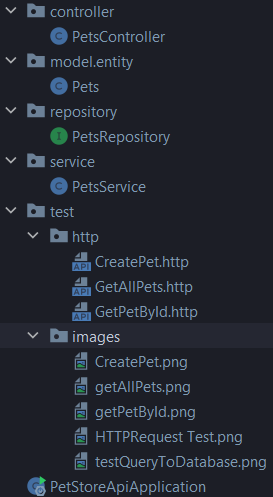
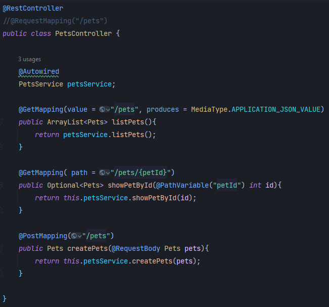
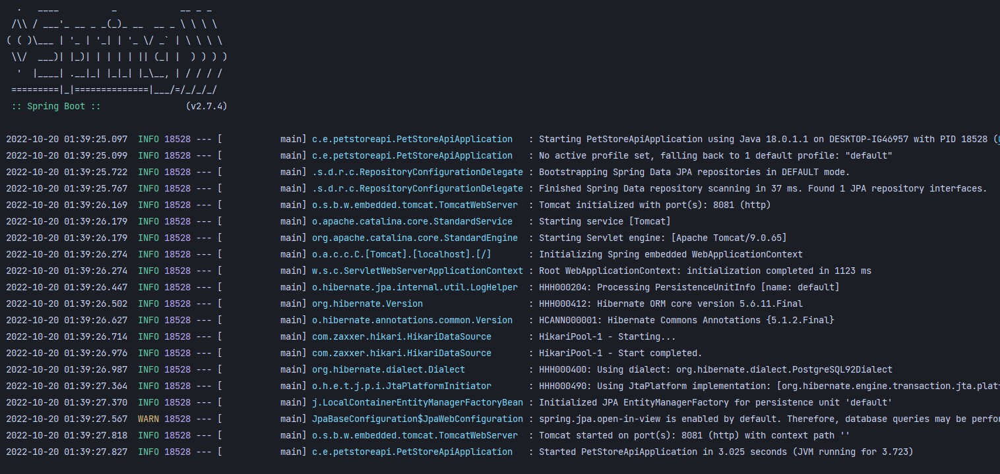
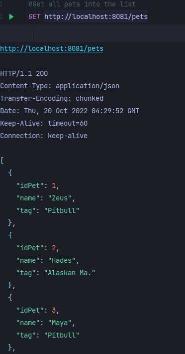
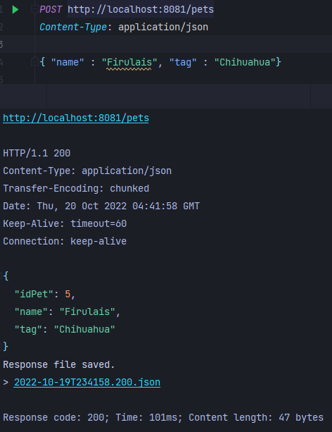
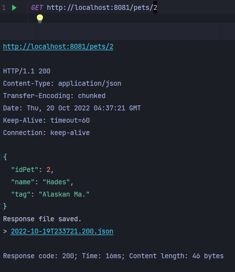
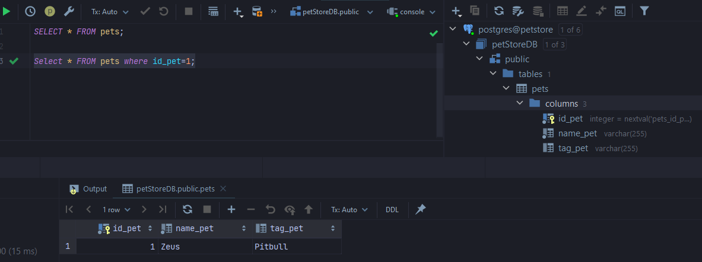
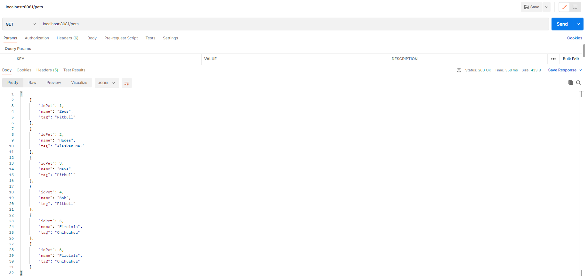
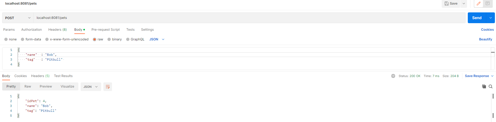
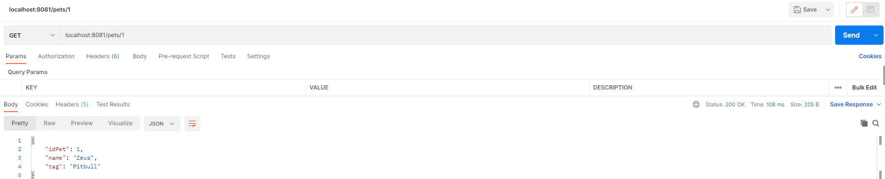

# Pet Store API REST

Pet Store API REST consumes 3 methods that request to PostgreSQL database.

| URL           | METHOD |         RESPONSE | OPERATION ID |
|:--------------|:------:|-----------------:|-------------:|
| /pets         |  GET   |    List all Pets |     listPets |
| /pets         |  POST  |     Create a Pet |   createPets |
| /pets/{petId} |  GET   | Details of a Pet |  showPetById |

## Tools used:
* [Spring Framework](https://spring.io/)
* [Lombok](https://projectlombok.org/)
* [Httpx Requests](https://plugins.jetbrains.com/plugin/18807-httpx-requests)
* [PostgreSQL](https://www.postgresql.org/)
* [Hibernate](https://hibernate.org/)

## Instalation
Spring offers a quickly built of our apps. In this case I created from IntelliJ IDEA Ultimate for web and enterprise development.
This version include a Spring Initializr that is not necessary create it from the spring initializr.

1. Create a project with the dependencies necessaries
--------------------------------------------------------
2. Coding our logic
    ### Package
   1. Controller
   2. Model
   3. Repository
   4. Service
   5. Test

   
   
--------------------------------------------------------

3. Create the methods necessaries for query DB
   1. GET all pets
   2. POST a pet
   3. GET a pet
   

--------------------------------------------------------
4. Running app

--------------------------------------------------------
5. Test our app
   1. CreatePet.HTTP
   2. GetAllPets.HTTP
   3. GetPetById.HTTP

## Test 
Using **HTTPx Request** to check the functionality of our requests.
These test are into the *test.http* package

Using **SQL queries** to check the functionality of our database. 

Using **Postman** to check the functionality of our request. 
* GET ALL PETS
* POST A PET
* GET A PET